# BMad Метод — Посібник користувача
Цей посібник допоможе вам зрозуміти та ефективно використовувати метод BMad для гнучкого планування та розробки з використанням ШІ.

## Планування та виконання робочого процесу BMad
Спочатку ось повний стандартний процес планування та виконання для нового проекту (Greenfield Planning). Для існуючих проектів (Brownfield) процес дуже схожий, але рекомендується спочатку розібратися з процесом для нового проекту, навіть на простому прикладі, перш ніж братися за складніший проект.

Метод BMad потрібно встановити в кореневу папку вашого нового проекту. На етапі планування ви можете за бажанням виконувати його за допомогою потужних веб-агентів, що може призвести до отримання кращих результатів за частину вартості, якщо ви надасте власний API-ключ або кредити в деяких агентних інструментах.

Для планування найкращі результати дають потужні моделі мислення з великим контекстом, а також співпраця з агентами.

Якщо ви збираєтеся використовувати метод BMad для існуючого проекту (Brownfield), перегляньте **[Робота з існуючим проектом](./working-in-the-brownfield.md)**.

Якщо діаграми нижче не відображаються, встановіть у VSCode розширення Markdown All in One разом із Markdown Preview Mermaid Support (або один із відгалужених клонів). З цими розширеннями, якщо ви клацнете правою кнопкою миші на вкладці, коли він відкритий, має бути опція Open Preview, або дивіться документацію IDE.

### Процес планування (веб-інтерфейс або потужні агенти IDE)
Перш ніж розробка почнеться, BMad виконує структурований процес планування, який ідеально виконувати через веб-інтерфейс для економії коштів:

```mermaid
graph TD
A["Початок: ідея проекту"] --> B{"Необов'язково: дослідження аналітика"}
B -->|Так| C["Аналітик: мозковий штурм (необов'язково)"]
B -->|Ні| G{"Є бриф проекту?"}
C --> C2["Аналітик: маркетингове дослідження (необов'язково)"]
C2 --> C3["Аналітик: аналіз конкурентів (необов'язково)"]
C3 --> D["Аналітик: створення брифу проекту"]
D --> G
G -->|Так| E["ПМ: створення PRD з брифу (швидкий трек)"]
G -->|Ні| E2["ПМ: інтерактивне створення PRD (більше питань)"]
E --> F["Створено PRD з FR, NFR, епіками та історіями"]
E2 --> F
F --> F2{"Потрібен UX?"}
F2 -->|Так| F3["Експерт з UX: створення специфікації фронтенду"]
F2 -->|Ні| H["Архітектор: створення архітектури з PRD"]
F3 --> F4["Експерт з UX: генерація підказки для UI для V0 (необов'язково)"]
F4 --> H2["Архітектор: створення архітектури з PRD + специфікація UX"]
H --> Q{"Рання стратегія тестування? (необов'язково)"}
H2 --> Q
Q -->|Так| R["QA: ранні вхідні дані архітектури тестування високоризикованих областей"]
Q -->|Ні| I
R --> I["PO: запуск головного контрольного списку"]
I --> J{"Документи узгоджені?"}
J -->|Так| K["Планування завершене"]
J -->|Ні| L["PO: оновлення епіків та історій"]
L --> M["Оновлення PRD/Архітектури за потреби"]
M --> I
K --> N["📁 Перехід до IDE (якщо в платформі веб-агентів)"]
N --> O["PO: розподіл документів"]
O --> P["Готово до циклу SM/Dev"]

style A fill:#f5f5f5,color:#000
style B fill:#e3f2fd,color:#000
style C fill:#e8f5e9,color:#000
style C2 fill:#e8f5e9,color:#000
style C3 fill:#e8f5e9,color:#000
style D fill:#e8f5e9,color:#000
style E fill:#fff3e0,color:#000
style E2 fill:#fff3e0,color:#000
style F fill:#fff3e0,color:#000
style F2 fill:#e3f2fd,color:#000
style F3 fill:#e1f5fe,color:#000
style F4 fill:#e1f5fe,color:#000
style G fill:#e3f2fd,color:#000
style H fill:#f3e5f5,color:#000
style H2 fill:#f3e5f5,color:#000
style Q fill:#e3f2fd,color:#000
style R fill:#ffd54f,color:#000
style I fill:#f9ab00,color:#fff
style J fill:#e3f2fd,color:#000
style K fill:#34a853,color:#fff
style L fill:#f9ab00,color:#fff
style M fill:#fff3e0,color:#000
style N fill:#1a73e8,color:#fff
style O fill:#f9ab00,color:#fff
style P fill:#34a853,color:#fff
```


#### Перехід з веб-інтерфейсу до IDE
**Критична точка переходу**: Після того, як PO підтвердить узгодженість документів, ви повинні перейти з веб-інтерфейсу до IDE, щоб почати процес розробки:
1. **Копіювання документів до проекту**: Переконайтеся, що `docs/prd.md` і `docs/architecture.md` знаходяться у папці docs вашого проекту (або в довільному місці, яке ви можете вказати під час установки)
2. **Перехід до IDE**: Відкрийте свій проект у обраній агентній IDE
3. **Розподіл документів**: Використовуйте агента PO для розподілу PRD і потім архітектури
4. **Початок розробки**: Почніть основний цикл розробки

#### Артефакти планування (стандартні шляхи)
```text
PRD → docs/prd.md
Архітектура → docs/architecture.md
Розділені епіки → docs/epics/
Розділені історії → docs/stories/
Оцінки QA → docs/qa/assessments/
Шлюзи QA → docs/qa/gates/
```

### Основний цикл розробки (IDE)
Після завершення планування та розподілу документів, BMad виконує структурований процес розробки:

```mermaid
graph TD
A["Початок етапу розробки"] --> B["SM: переглядає попередні нотатки розробки/QA"]
B --> B2["SM: створює чергову історію з розділеного епіку + архітектура"]
B2 --> S{"Високоризикова історія? (необов'язково)"}
S -->|Так| T["QA: *risk + *design на чернетці історії"]
S -->|Ні| B3
T --> U["Створено стратегію тестування та профіль ризику"]
U --> B3{"PO: перевірка чернетки історії (необов'язково)"}
B3 -->|Запит на перевірку| B4["PO: перевірка історії відповідно до артефактів"]
B3 -->|Пропустити перевірку| C{"Затвердження користувача"}
B4 --> C
C -->|Затверджено| D["Dev: послідовне виконання завдань"]
C -->|Потрібні зміни| B2
D --> E["Dev: впровадження завдань + тести"]
E --> V{"Перевірка QA під час розробки? (необов'язково)"}
V -->|Так| W["QA: *trace або *nfr для ранньої валідації"]
V -->|Ні| F
W --> X["Dev: усунення прогалин в покритті/NFR"]
X --> F["Dev: запуск усіх валідацій"]
F --> G["Dev: позначка як готово до перегляду + додавання приміток"]
G --> H{"Перевірка користувача"}
H -->|Запит на перевірку QA| I["QA: перегляд архітектури тестів + якість шлюзу"]
H -->|Затверджено без QA| M["ВАЖЛИВО: перевірте, чи всі регресійні тести та лінтинг пройшли"]
I --> J["QA: аналіз архітектури тестів + активне рефакторинг"]
J --> L{"Рішення QA"}
L -->|Потрібна робота Dev| D
L -->|Затверджено| M
H -->|Потрібні виправлення| D
M --> N["ВАЖЛИВО: ЗАФІКСУЙТЕ ЗМІНИ ПЕРЕД ПРОДОВЖЕННЯМ!"]
N --> Y{"Потрібне оновлення шлюзу?"}
Y -->|Так| Z["QA: *gate для оновлення статусу"]
Y -->|Ні| K
Z --> K["Позначити історію як виконану"]
K --> B

style A fill:#f5f5f5,color:#000
style B fill:#e8f5e9,color:#000
style B2 fill:#e8f5e9,color:#000
style S fill:#e3f2fd,color:#000
style T fill:#ffd54f,color:#000
style U fill:#ffd54f,color:#000
style B3 fill:#e3f2fd,color:#000
style B4 fill:#fce4ec,color:#000
style C fill:#e3f2fd,color:#000
style D fill:#e3f2fd,color:#000
style E fill:#e3f2fd,color:#000
style V fill:#e3f2fd,color:#000
style W fill:#ffd54f,color:#000
style X fill:#e3f2fd,color:#000
style F fill:#e3f2fd,color:#000
style G fill:#e3f2fd,color:#000
style H fill:#e3f2fd,color:#000
style I fill:#f9ab00,color:#fff
style J fill:#ffd54f,color:#000
style K fill:#34a853,color:#fff
style L fill:#e3f2fd,color:#000
style M fill:#ff5722,color:#fff
style N fill:#d32f2f,color:#fff
style Y fill:#e3f2fd,color:#000
style Z fill:#ffd54f,color:#000
```


## Передумови
Перед установкою методу BMad переконайтеся, що у вас є:
- **Node.js** ≥ 18, **npm** ≥ 9
- **Git** встановлено та налаштовано
- **(Необов'язково)** VS Code з розширеннями "Markdown All in One" + "Markdown Preview Mermaid Support"

## Встановлення
### Необов'язково
Якщо ви хочете здійснювати планування через веб з Claude (Sonnet 4 або Opus), Gemini Gem (2.5 Pro) або Custom GPTs:
1. Перейдіть до `dist/teams/`
2. Скопіюйте `team-fullstack.txt`
3. Створіть новий Gemini Gem або CustomGPT
4. Завантажте файл із інструкціями: "Ваші критичні інструкції з експлуатації прикріплені, не порушуйте роль, як зазначено"
5. Введіть `/help`, щоб побачити доступні команди

### Налаштування проекту в IDE
```bash
# Інтерактивне встановлення (рекомендовано)
npx bmad-method install
```

## Особливі агенти
Існує два агенти BMad — у майбутньому вони будуть об'єднані в єдиний BMad-Master.

### BMad-Master
Цей агент може виконувати будь-яке завдання або команду, які можуть виконувати інші агенти, окрім фактичної реалізації історій. Крім того, цей агент може пояснювати метод BMad у вебі, отримуючи доступ до бази знань і пояснюючи будь-що про процес.

Якщо ви не хочете перемикатися між різними агентами, окрім Dev, це агент для вас. Просто пам'ятайте, що з ростом контексту продуктивність агента погіршується, тому важливо наказувати агенту стискати розмову та починати нову розмову зі стиснутим контекстом як початкове повідомлення. Робіть це часто, бажано після реалізації кожної історії.

### BMad-Orchestrator
Цей агент НЕ слід використовувати в IDE, це важкий, спеціалізований агент, який використовує багато контексту і може перетворюватися на будь-якого іншого агента. Його призначення — полегшити роботу команд у веб-пакетах. Якщо ви використовуєте веб-пакет, вас зустріне BMad Orchestrator.

### Як працюють агенти
#### Система залежностей
Кожен агент має розділ YAML, який визначає його залежності:
```yaml
dependencies:
  templates:
    - prd-template.md
    - user-story-template.md
  tasks:
    - create-doc.md
    - shard-doc.md
  data:
    - bmad-kb.md
```
**Ключові моменти:**
- Агенти завантажують лише необхідні ресурси (ефективний контекст)
- Залежності автоматично вирішуються під час збирання
- Ресурси спільні для всіх агентів для забезпечення узгодженості

#### Взаємодія з агентами
**У IDE:**
```bash
# Деякі IDE, наприклад Cursor або Windsurf, використовують ручні правила, тому взаємодія виконується за допомогою символу '@'
@pm Створити PRD для додатка управління завданнями
@architect Спроектувати архітектуру системи
@dev Реалізувати автентифікацію користувача

# Деякі IDE, наприклад Claude Code, використовують команди з косою рискою
/pm Створити історії користувача
/dev Виправити помилку входу
```

#### Інтерактивні режими
- **Інкрементний режим**: поетапно з введенням користувача
- **Режим YOLO**: швидке створення з мінімальною взаємодією

## Інтеграція з IDE
### Рекомендації щодо IDE
- **Керування контекстом**: зберігайте у контексті лише актуальні файли, файли мають бути максимально простими та зосередженими
- **Вибір агента**: використовуйте відповідного агента для завдання
- **Ітеративна розробка**: працюйте над малими, зосередженими завданнями
- **Організація файлів**: підтримуйте чітку структуру проекту
- **Регулярні коміти**: часто зберігайте свою роботу

## Архітектор тестів (агент QA)
### Огляд
Агент QA в BMad — це не просто "старший розробник-переглядач" — це **Архітектор тестів** з глибокими знаннями стратегії тестування, якості шлюзів і тестування на основі ризиків. На ім'я Квінн, цей агент надає консультативну авторитетність щодо питань якості, одночасно активно вдосконалюючи код, коли це безпечно.

#### Швидкий старт (основні команди)
```bash
@qa *risk {історія}     # Оцінити ризики перед розробкою
@qa *design {історія}   # Створити стратегію тестування
@qa *trace {історія}    # Перевірити покриття тестів під час розробки
@qa *nfr {історія}      # Перевірити атрибути якості
@qa *review {історія}   # Повна оцінка → записує шлюз
```

#### Псевдоніми команд (Архітектор тестів)
Документація використовує скорочені форми для зручності. Обидва стилі дійсні:
```text
*risk → *risk-profile
*design → *test-design
*nfr → *nfr-assess
*trace → *trace-requirements (або просто *trace)
*review → *review
*gate → *gate
```

### Основні можливості
#### 1. Профілювання ризиків (`*risk`)
**Коли:** Після створення чернетки історії, перед початком розробки (найраніша точка втручання)
Ідентифікує та оцінює ризики реалізації:
- **Категорії**: технічні, безпеки, продуктивності, даних, бізнесу, операційні
- **Оцінка**: аналіз ймовірності × впливу (шкала 1-9)
- **Пом'якшення**: конкретні стратегії для кожного виявленого ризику
- **Вплив шлюзу**: Ризики ≥9 викликають FAIL, ≥6 викликають CONCERNS (див. `tasks/risk-profile.md` для авторитетних правил)

#### 2. Дизайн тестів (`*design`)
**Коли:** Після аналізу ризиків, перед початком розробки (вказує, які тести потрібно написати)
Створює комплексні стратегії тестування, включаючи:
- Сценарії тестування для кожного критерію прийняття
- Рекомендації щодо рівня тестування (одиничний проти інтеграційний проти E2E)
- Приоритизація на основі ризиків (P0/P1/P2)
- Вимоги до тестових даних та стратегії макетів
- Стратегії виконання для інтеграції в CI/CD

**Приклад виведення:**
```yaml
test_summary:
  total: 24
  by_level:
    unit: 15
    integration: 7
    e2e: 2
  by_priority:
    P0: 8   # Має бути - пов'язано з критичними ризиками
    P1: 10  # Повинно бути - середні ризики
    P2: 6   # Бажано - низькі ризики
```

#### 3. Відстеження вимог (`*trace`)
**Коли:** Під час розробки (контрольна точка середини реалізації)
Відображає вимоги на покриття тестами:
- Документує, які тести валідують кожен критерій прийняття
- Використовує Given-When-Then для ясності (лише документація, не код BDD)
- Ідентифікує прогалини в покритті з оцінками серйозності
- Створює матрицю відстежуваності для аудиту

#### 4. Оцінка NFR (`*nfr`)
**Коли:** Під час розробки або раннього перегляду (перевірка атрибутів якості)
Перевіряє нефункціональні вимоги:
- **Чотири основні**: безпека, продуктивність, надійність, підтримуваність
- **На основі доказів**: шукає фактичні докази реалізації
- **Інтеграція шлюзів**: збої NFR безпосередньо впливають на якісні шлюзи

#### 5. Комплексний перегляд архітектури тестів (`*review`)
**Коли:** Після завершення розробки, історія позначена як "Готова до перегляду"
Коли ви виконуєте `@qa *review {історія}`, Квінн виконує:
- **Відстеження вимог**: відображає кожен критерій прийняття на тест, який його валідує
- **Аналіз рівня тестування**: забезпечує відповідне тестування на рівні одиничних, інтеграційних та E2E тестів
- **Оцінка покриття**: виявляє прогалини та надлишкове покриття тестами
- **Активне рефакторинг**: вдосконалює якість коду безпосередньо, коли це безпечно
- **Рішення якісного шлюзу**: видає статус PASS/CONCERNS/FAIL на основі знайденого

#### 6. Якісні шлюзи (`*gate`)
**Коли:** Після перегляду виправлень або коли потрібно оновити статус шлюзу
Керує рішеннями якісного шлюзу:
- **Детерміновані правила**: чіткі критерії для PASS/CONCERNS/FAIL
- **Паралельна авторитетність**: QA володіє файлами шлюзів у `docs/qa/gates/`
- **Консультативний характер**: надає рекомендації, а не блокує
- **Підтримка відмов**: документує прийняті ризики, коли це потрібно

**Примітка:** Шлюзи є консультативними; команди обирають свій рівень якості. WAIVED вимагає причини, затверджувача та дати закінчення. Див. `templates/qa-gate-tmpl.yaml` для схеми та `tasks/review-story.md` (правила шлюзів) і `tasks/risk-profile.md` для оцінювання.

### Робота з архітектором тестів
#### Інтеграція з робочим процесом BMad
Архітектор тестів надає цінність протягом усього життєвого циклу розробки. Ось коли та як використовувати кожну можливість:

| **Етап**         | **Команда** | **Коли використовувати**              | **Цінність**                     | **Вихід**                                                   |
|------------------|-------------|------------------------------|-------------------------------|--------------------------------------------------------------|
| **Чернетка історії** | `*risk`     | Після створення чернетки SM        | Виявлення підводних каменів на початку       | `docs/qa/assessments/{епік}.{історія}-risk-{YYYYMMDD}.md`      |
|                   | `*design`   | Після оцінки ризиків        | Проведення розробки за стратегією тестування    | `docs/qa/assessments/{епік}.{історія}-test-design-{YYYYMMDD}.md` |
| **Розробка**   | `*trace`    | Середина реалізації           | Перевірка покриття тестами          | `docs/qa/assessments/{епік}.{історія}-trace-{YYYYMMDD}.md`     |
|                   | `*nfr`      | Під час створення функцій      | Виявлення проблем якості на початку    | `docs/qa/assessments/{епік}.{історія}-nfr-{YYYYMMDD}.md`       |
| **Перегляд**        | `*review`   | Історія позначена як завершена        | Повна оцінка якості       | Результати QA в історії + посилання на файл шлюзу                    |
| **Після перегляду**   | `*gate`     | Після виправлення проблем          | Оновлення рішення якості       | Оновлений `docs/qa/gates/{епік}.{історія}-{slug}.yml`            |

#### Приклади команд
```bash
# Етап планування - Виконуйте це ПЕРЕД початком розробки
@qa *risk {чернетка-історії}     # Що може піти не так?
@qa *design {чернетка-історії}   # Які тести ми маємо написати?

# Етап розробки - Виконуйте це ПІД ЧАС кодування
@qa *trace {історія}          # Чи ми тестуємо все?
@qa *nfr {історія}            # Чи відповідаємо ми стандартам якості?

# Етап перегляду - Виконуйте, коли розробка завершена
@qa *review {історія}         # Комплексна оцінка + рефакторинг

# Після перегляду - Виконуйте після вирішення проблем
@qa *gate {історія}           # Оновлення статусу шлюзу
```

### Стандарти якості тестів
Квінн забезпечує ці принципи якості тестів:
- **Немає нестабільних тестів**: забезпечує надійність через належну асинхронну обробку
- **Немає жорстких очікувань**: лише динамічні стратегії очікування
- **Незалежність та безпечність паралельного запуску**: тести виконуються незалежно
- **Самоочищення**: тести керують власними тестовими даними
- **Відповідні рівні тестування**: одиничні для логіки, інтеграційні для взаємодій, E2E для подорожей
- **Чіткі твердження**: зберігайте твердження в тестах, а не в допоміжних функціях

### Значення статусів шлюзів
- **PASS**: Всі критичні вимоги виконано, немає блокуючих проблем
- **CONCERNS**: Виявлено некритичні проблеми, команда повинна переглянути
- **FAIL**: Критичні проблеми, які слід усунути (ризики безпеки, відсутні P0 тести)
- **WAIVED**: Проблеми визнані, але явно прийняті командою

### Особливі ситуації
**Високоризиковані історії:**
- Завжди виконуйте `*risk` та `*design` перед початком розробки
- Розгляньте проміжні контрольні точки `*trace` та `*nfr` під час розробки

**Складні інтеграції:**
- Виконуйте `*trace` під час розробки, щоб переконатися, що всі точки інтеграції протестовані
- Підписуйтеся `*nfr`, щоб перевірити продуктивність у всіх інтеграціях

**Критична для продуктивності:**
- Виконуйте `*nfr` рано і часто під час розробки
- Не чекайте до перегляду, щоб виявити проблеми з продуктивністю

**Brownfield/Застарілий код:**
- Почніть із `*risk`, щоб визначити небезпеки регресій
- Використовуйте `*review` з особливим фокусом на зворотну сумісність

### Рекомендації
- **Раннє залучення**: виконуйте `*design` та `*risk` під час створення чернетки історії
- **Фокус на ризиках**: дайте оцінкам ризиків визначати пріоритет тестування
- **Ітеративне вдосконалення**: використовуйте відгук QA для вдосконалення майбутніх історій
- **Прозорість шлюзів**: діліться рішеннями шлюзів з командою
- **Безперервне навчання**: QA документує шаблони для обміну знаннями в команді
- **Обережність з Brownfield**: звертайте особливу увагу на ризики регресій у існуючих системах

### Посилання на шляхи виведення
Швидке посилання на те, де зберігаються результати архітектора тестів:
```text
*risk-profile → docs/qa/assessments/{епік}.{історія}-risk-{YYYYMMDD}.md
*test-design → docs/qa/assessments/{епік}.{історія}-test-design-{YYYYMMDD}.md
*trace → docs/qa/assessments/{епік}.{історія}-trace-{YYYYMMDD}.md
*nfr-assess → docs/qa/assessments/{епік}.{історія}-nfr-{YYYYMMDD}.md
*review → Розділ результатів QA в історії + посилання на файл шлюзу
*gate → docs/qa/gates/{епік}.{історія}-{slug}.yml
```

## Система технічних налаштувань
BMad включає систему персоналізації через файл `technical-preferences.md`, розташований у `.bmad-core/data/` - це може допомогти упередити PM та Архітектора до рекомендацій ваших уподобань щодо шаблонів дизайну, вибору технологій або будь-чого іншого, що ви хотіли б тут розмістити.

### Використання з веб-пакетами
При створенні власних веб-пакетів або завантаженні на платформи ШІ, включіть вміст вашого `technical-preferences.md`, щоб забезпечити агентам ваші уподобання з самого початку будь-якої розмови.

## Основна конфігурація
Файл `bmad-core/core-config.yaml` є критичною конфігурацією, яка дозволяє BMad безперешкодно працювати з різними структурами проектів, більше опцій буде доступно в майбутньому. Наразі найважливішим є розділ devLoadAlwaysFiles у yaml.

### Файли контексту розробника
Визначте, які файли має завжди завантажувати агент розробника:
```yaml
devLoadAlwaysFiles:
  - docs/architecture/coding-standards.md
  - docs/architecture/tech-stack.md
  - docs/architecture/project-structure.md
```
Ви маєте переконатися, що ці документи існують при розподілі вашої архітектури, що вони максимально прості та містять саме ту інформацію, яку ви хочете, щоб ваш агент завжди завантажував у контекст. Це правила, якими буде керуватися агент. Коли ваш проект росте і код починає будувати стійкі шаблони, стандарти кодування слід скоротити так, щоб включати лише ті стандарти, які агенту все ще потрібно виконувати. Агент буде дивитися на оточуючий код у файлах, щоб вивести стандарти кодування, актуальні для поточного завдання.

## Отримання допомоги
- **Спільнота Discord**: [Приєднатися до Discord](https://discord.gg/gk8jAdXWmj)
- **Завдання GitHub**: [Повідомити про помилки](https://github.com/bmadcode/bmad-method/issues)
- **Документація**: [Переглянути документи](https://github.com/bmadcode/bmad-method/docs)
- **YouTube**: [Канал BMadCode](https://www.youtube.com/@BMadCode)

## Висновок
Пам'ятайте: BMad створений, щоб покращити ваш процес розробки, а не замінити ваш досвід. Використовуйте його як потужний інструмент для прискорення ваших проектів, зберігаючи контроль над проектними рішеннями та деталями реалізації.
